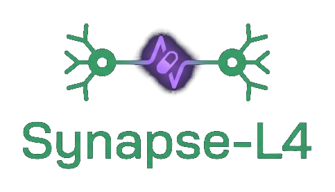
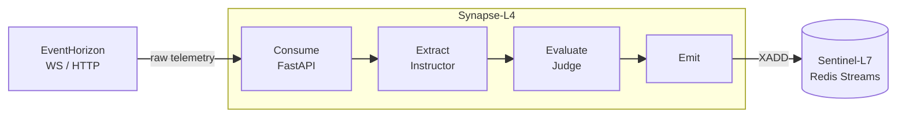

<p align="center">
  
</p>

# AI Logic & Evaluation Sidecar


**Synapse-L4** is the validation node between EventHorizon and Sentinel-L7 — it transforms raw, high-throughput telemetry into deterministic, schema-validated **Axioms** that Sentinel-L7 can safely cache and act upon.

Architecturally, this project is a blueprint for **structured-generation validation at a system boundary**. It demonstrates how to force LLM output through a typed contract — Consume → Extract → Evaluate → Emit — with a deterministic fast path, a mandatory rule-based judge pass, and an immutable emission model.

It's one node in the Rhizome Risk system, but its own architectural contract is scoped to these two neighbors; it doesn't know or care that the rest of the system exists.

---



---

## 📋 Contents

- [📋 Contents](#-contents)
- [🌐 Role in the Ecosystem](#-role-in-the-ecosystem)
- [🧰 Stack](#-stack)
- [🚀 Running the Project](#-running-the-project)
  - [✅ Prerequisites](#-prerequisites)
  - [⚡ Quick Start](#-quick-start)
  - [⚙️ Commands](#️-commands)
- [🏗️ Architecture](#️-architecture)
  - [🔀 Four-Stage Validation Node](#-four-stage-validation-node)
  - [🗂️ Project Structure](#️-project-structure)
  - [🧩 Reliability Patterns](#-reliability-patterns)
- [🔭 Observability](#-observability)
- [📚 Docs](#-docs)
- [🐛 Known Issues](#-known-issues)
- [🗺️ Roadmap](#️-roadmap)
  - [📋 Planned](#-planned)
  - [📦 Build History](#-build-history)

## 🌐 Role in the Ecosystem

| System | Role | Tech | Responsibility |
|---|---|---|---|
| ⚡ **EventHorizon** | Nervous System | TypeScript, Fastify, RabbitMQ | Real-time telemetry ingestion, reactive data plane |
| 🧠 **Synapse-L4** | Validation Node | Python, FastAPI, Pydantic + Instructor | Specification-driven orchestration, LLM contract enforcement |
| 🛡️ **Sentinel-L7** | Gatekeeper | Laravel, Redis Streams, Upstash Vector | Semantic caching, API gateway, financial/transactional state |

## 🧰 Stack

**🐍 Core Engine**

- **Python 3.12+ / asyncio:** Async throughout — the ingest route, the EventHorizon WebSocket consumer, and the Sentinel-L7 emitter are all non-blocking.
- **FastAPI:** Async-native routing with dependency injection, chosen for its first-class Pydantic integration.

**🤖 LLM Contract Enforcement**

- **Pydantic v2:** `frozen=True` models make an emitted `Axiom` immutable at the type level — no mutation is possible after the Judge pass succeeds.
- **Instructor:** Wraps the LLM client so every unstructured payload is coerced into a validated Pydantic model — raw LLM strings never reach a caller directly.

**🔭 Observability**

- **Logfire:** Wide spans across the pipeline, OTLP export to Rhizome Lens, and accuracy benchmarking for extraction quality.

**🧪 Engineering & Test Tooling**

- **uv:** Fast, lockfile-based dependency management (`pyproject.toml` + `uv.lock`).
- **pytest + pytest-asyncio:** Colocated `*_test.py` files per module; 117 tests across models, nodes, clients, and observability.

## 🚀 Running the Project

### ✅ Prerequisites

- **Python 3.12+**
- **[uv](https://docs.astral.sh/uv/)**

> [!NOTE]
> Synapse-L4 is a sidecar — it expects EventHorizon (upstream) and Sentinel-L7 (downstream) to be reachable, but both are optional at boot. Without `EVENTHORIZON_WS_URL` set, the WebSocket consumer simply doesn't start; without a reachable Sentinel-L7, emission calls fail per-request rather than blocking startup.

### ⚡ Quick Start

```bash
# 1. Clone and install
git clone https://github.com/obrienma/synapse-l4
cd synapse-l4
uv sync

# 2. Configure environment
cp .env.example .env
# Edit .env — add OPENAI_API_KEY, SENTINEL_REDIS_URL, etc.

# 3. Run
uv run fastapi dev main.py

# 4. POST a telemetry payload
curl -X POST localhost:8000/ingest -H "Content-Type: application/json" -d '{...}'
```

### ⚙️ Commands

| Command | Description |
| --- | --- |
| `uv run fastapi dev main.py` | Start FastAPI dev server (hot reload, `:8000`) |
| `uv run pytest` | Run full test suite |
| `uv run pytest -x` | Stop on first failure |
| `uv run mypy src/` | Type check (`strict = true`) |
| `uv run pytest-watch` | Watch mode |

## 🏗️ Architecture

### 🔀 Four-Stage Validation Node

```
Consume  →  Extract  →  Evaluate  →  Emit
```



```mermaid
flowchart LR
    EH["EventHorizon\n(WebSocket / HTTP POST)"]
    -->|raw telemetry packet| C

    subgraph Synapse-L4 ["Synapse-L4 Validation Node"]
        C["Consume\nsrc/api/ingest.py"]
        -->|RawTelemetry| X

        X["Extract\nsrc/nodes/extractor.py\n(Pydantic + Instructor)"]
        -->|Axiom candidate| J

        J["Evaluate\nsrc/nodes/judge.py\n(business rule validation)"]
        -->|validated Axiom| E

        E["Emit\nsrc/nodes/emitter.py"]
    end

    E -->|XADD synapse:axioms| SL7["Sentinel-L7\n(Redis Streams)"]

    click C "https://github.com/obrienma/synapse-l4/tree/master/src/api/ingest.py" "Go to Consume Source"
    click X "https://github.com/obrienma/synapse-l4/tree/master/src/nodes/extractor.py" "Go to Extract Source"
    click J "https://github.com/obrienma/synapse-l4/tree/master/src/nodes/judge.py" "Go to Evaluate Source"
    click E "https://github.com/obrienma/synapse-l4/tree/master/src/nodes/emitter.py" "Go to Emit Source"

    classDef clickable fill:#1d4ed8,stroke:#1e40af,stroke-width:2px,color:#ffffff
    class C,X,J,E clickable
```

Data flows **one direction only** — no stage calls back to a previous stage. Each stage is independently unit-tested.

### 🗂️ Project Structure

| Stage | Key Files | Purpose & Responsibilities |
| :--- | :--- | :--- |
| **📥 Consume** | `src/api/ingest.py` | FastAPI `POST /ingest` route — accepts raw telemetry, hands it to the pipeline runner. |
| **🔎 Extract** | `src/nodes/extractor.py` <br> `src/models/axiom.py` | Maps raw payload → typed `AxiomDraft`. `_try_direct_extraction()` is a deterministic fast path for structured payloads; only unstructured payloads reach the LLM via Instructor. |
| **⚖️ Evaluate** | `src/nodes/judge.py` <br> `src/evaluation/rules.py` | Validates an `AxiomDraft` against hard business rules (pure functions, no I/O). Mandatory — extraction never reaches emission without passing Judge. |
| **📤 Emit** | `src/nodes/emitter.py` <br> `src/clients/sentinel.py` | Constructs the immutable `Axiom` and `XADD`s it to Sentinel-L7's Redis Stream. |
| **🔌 Clients** | `src/clients/eventhorizon.py` | WebSocket consumer for EventHorizon's live telemetry feed — bounded queue + worker pool decouples the read loop from LLM latency. |
| **🔭 Observation** | `src/observation/instrumentation.py` | Logfire configuration, FastAPI/httpx instrumentation, OTLP export. |
| **⚙️ Config** | `config.py` | Pydantic `BaseSettings` — process exits on startup if any required env var is missing or invalid. |

### 🧩 Reliability Patterns

* **Validator-as-Judge:** business rules run as a dedicated stage after extraction, not inline inside the Instructor call — see [ADR 0004](docs/adr/0004-judge-as-separate-pipeline-stage.md).
* **Structured generation over prompt-engineered JSON:** every LLM output is coerced into a Pydantic model via Instructor — see [ADR 0002](docs/adr/0002-instructor-for-structured-generation.md).
* **Frozen models for idempotent emission:** `Axiom` is immutable once constructed; the Emitter builds it from scratch rather than mutating a draft — see [ADR 0003](docs/adr/0003-frozen-pydantic-axioms.md).
* **Deterministic fast path before LLM fallback:** structured payloads never reach the LLM, bounding token spend under load.
* **Deduplication delegated downstream:** Synapse-L4 does not deduplicate Axioms — Sentinel-L7 owns that via its transactional state — see [ADR 0007](docs/adr/0007-deduplication-delegated-to-sentinel.md).

## 🔭 Observability

Synapse-L4 emits wide spans across all four pipeline stages via **Logfire**, with OTLP export to **[Rhizome Lens](https://github.com/obrienma/rhizome-observability#readme)** — the same self-hosted OTel Collector → Tempo/Loki/Prometheus → Grafana stack that EventHorizon and Sentinel-L7 export to, so a single telemetry event can in principle be followed across all three pipeline stages.

* **Structured generation accuracy benchmarking** — Logfire tracks extraction outcomes so LLM reliability is measurable over time, not just observed anecdotally.
* **`traceparent` on Redis Streams** — trace context is injected into the `XADD` payload so Sentinel-L7 can continue the same trace downstream (see [docs/journal.md](docs/journal.md), OTel Phase 1).
* **No-op when unconfigured** — without `LOGFIRE_TOKEN` or `OTEL_EXPORTER_OTLP_ENDPOINT` set, instrumentation calls no-op silently rather than failing startup.
* **Evaluated from outside, not instrumented by it** — Arbiter-L8 calls this service's HTTP/MCP surface to score Axiom quality offline and online, out-of-band. Synapse-L4 has no awareness of Arbiter-L8 and never calls it.

## 📚 Docs

| File | Contents | Last updated |
| --- | --- | --- |
| [README.md](README.md) | Project overview | 2026-07-03 |
| [ARCHITECTURE.md](docs/ARCHITECTURE.md) | Pipeline stages, data flow, integration points | 2026-05-01 |
| [API.md](docs/API.md) | Endpoints, request/response schemas | 2026-05-01 |
| [DEV_GETTING_STARTED.md](docs/DEV_GETTING_STARTED.md) | Full local setup walkthrough | 2026-04-01 |
| [TESTING.md](docs/TESTING.md) | Test strategy, per-phase patterns | 2026-03-31 |
| [AGENT_DIRECTIVES.md](docs/AGENT_DIRECTIVES.md) | Dual-LLM (Claude Code / Copilot) agent conventions | 2026-06-13 |
| [journal.md](docs/journal.md) | Engineering journal — one entry per phase | 2026-06-13 |
| [adr/](docs/adr/) | Architecture Decision Records (0001–0007) | 2026-06-06 |

## 🐛 Known Issues

- [ ] **Fragmented traces:** `_run_pipeline()` doesn't wrap `extract`/`judge`/`emit` in a parent span — a single pipeline run produces three trace IDs instead of one.

## 🗺️ Roadmap

### 📋 Planned

* [ ] **Trace Parenting:** Wrap `extract`/`judge`/`emit` in a single parent span inside `_run_pipeline()` to collapse the three-trace-ID fragmentation into one trace per event.
* [ ] **Learning Log → Journal Migration:** Finish migrating remaining `LEARNING_LOG.md` phase entries into `docs/journal.md` with round-trip Anki export (in progress — Phases 1–3 done).

### 📦 Build History

<details>
<summary>🔍 View phase-by-phase implementation history...</summary>

* **Phase 1 — Project Scaffold:** `pyproject.toml`, `config.py` (Pydantic `BaseSettings`, exits on invalid env), `.env.example`, ADR 0001/0005/0006.
* **Phase 2 — Axiom Contract + Extractor:** `src/models/axiom.py` (`Axiom`, `AxiomDraft`), `src/nodes/extractor.py` with Instructor-based extraction and a deterministic fast path.
* **Phase 3 — Judge Pass + Business Rules:** `src/nodes/judge.py`, `src/evaluation/rules.py` — pure-function rule validators, mandatory before emission.
* **Phase 4 — Emitter + Sentinel-L7 Client:** `src/nodes/emitter.py`, `src/clients/sentinel.py` — immutable `Axiom` construction and Redis Stream `XADD`.
* **Phase 5 — FastAPI Ingest Route:** `src/api/ingest.py`, `main.py` — `POST /ingest` and `GET /metrics` endpoints.
* **Phase 6 — EventHorizon WebSocket Consumer:** `src/clients/eventhorizon.py` — reconnect loop, then a bounded-queue/worker-pool split to decouple the read loop from LLM latency.
* **Phase 7 — Logfire Observation Layer:** `src/observation/instrumentation.py` — FastAPI/httpx instrumentation, OTLP export, no-op-safe when unconfigured.
* **Domain Field + ADR 0007:** Optional `domain` field on `Axiom`/`AxiomDraft` for policy namespace routing; deduplication responsibility formally delegated to Sentinel-L7.
* **OTel Phase 1:** OTLP export to Tempo plus `traceparent` injection on the Redis Stream `XADD` payload.
* **LL → Journal Migration:** Began migrating `LEARNING_LOG.md` phase entries to `docs/journal.md`, including Anki cloze round-trip.

</details>

> [!TIP]
> **117 tests passing** across models, pipeline nodes, clients, and observability instrumentation.