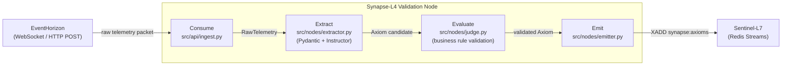

# 🧠 Synapse-L4 — AI Logic & Evaluation Sidecar

> **"The Brain"** in a three-system telemetry architecture. Synapse-L4 transforms raw, high-throughput telemetry from EventHorizon into deterministic, schema-validated **Axioms** that Sentinel-L7 can safely cache and act upon.

---

## 🌐 Role in the Ecosystem

```
┌─────────────────────┐     raw telemetry       ┌─────────────────────┐     validated Axioms    ┌─────────────────────┐
│   EventHorizon      │ ──────────────────────► │    Synapse-L4       │ ──────────────────────► │    Sentinel-L7      │
│  "Nervous System"   │                         │      "Brain"        │                         │   "Gatekeeper"      │
│  TS · Fastify       │                         │  Python · FastAPI   │                         │  Laravel · Redis    │
│  RabbitMQ · MongoDB │                         │  Pydantic+Instructor│                         │  Upstash Vector     │
└─────────────────────┘                         └─────────────────────┘                         └─────────────────────┘
```

| System | Role | Responsibility |
|---|---|---|
| ⚡ **EventHorizon** | Nervous System | Real-time telemetry ingestion, reactive data plane |
| 🧠 **Synapse-L4** | Brain | Specification-Driven orchestration, LLM contract enforcement |
| 🛡️ **Sentinel-L7** | Gatekeeper | Semantic caching, API gateway, financial/transactional state |

---


---
## 🔄 Architecture: Four-Stage Validation Node

```
Consume  →  Extract  →  Evaluate  →  Emit
```



Each stage is independently testable. Data flows one direction — no stage calls back to a previous stage.

---

## 🛠️ Stack

| Layer | Tech |
|---|---|
| 🐍 Language | Python 3.12+, asyncio |
| ⚡ Framework | FastAPI |
| 🤖 LLM contract enforcement | Pydantic v2 + Instructor |
| 🔭 Observability | Logfire |
| 📦 Package management | uv |
| 🧪 Testing | pytest + pytest-asyncio |

---

## 📁 Project Structure

```
synapse-l4/
├── src/
│   ├── api/             # FastAPI routes
│   ├── models/          # Pydantic Axiom schemas — shared contract
│   ├── nodes/           # Pipeline stages: extractor, judge, emitter
│   ├── evaluation/      # Business rule validators (pure functions)
│   ├── clients/         # EventHorizon WS consumer, Sentinel-L7 emitter
│   └── observation/     # Logfire instrumentation
├── config.py            # Pydantic BaseSettings — exits on invalid env
├── main.py              # FastAPI app entrypoint
├── docs/
│   ├── ARCHITECTURE.md
│   ├── API.md
│   ├── DEV_GETTING_STARTED.md
│   ├── TESTING.md
│   └── adr/             # Architecture Decision Records
└── pyproject.toml
```

---

## 🚀 Quick Start

**Prerequisites:** Python 3.12+, [uv](https://docs.astral.sh/uv/)

```bash
# Clone and install
git clone https://github.com/obrienma/synapse-l4
cd synapse-l4
uv sync

# Configure environment
cp .env.example .env
# Edit .env — add OPENAI_API_KEY, SENTINEL_REDIS_URL, etc.

# Run
uv run fastapi dev main.py
```

---

## ⚙️ Commands

```bash
uv run fastapi dev main.py   # FastAPI dev server (hot reload, :8000)
uv run pytest                    # Run full test suite
uv run pytest -x                 # Stop on first failure
uv run mypy src/                 # Type check
uv run pytest --watch            # Watch mode
```

---

## 📚 Docs

- [Architecture](docs/ARCHITECTURE.md) — pipeline stages, data flow, integration points
- [API Reference](docs/API.md) — endpoints, request/response schemas
- [Dev Getting Started](docs/DEV_GETTING_STARTED.md) — local setup walkthrough
- [Testing Strategy](docs/TESTING.md) — per-phase test patterns
- [ADRs](docs/adr/) — architectural decision records
