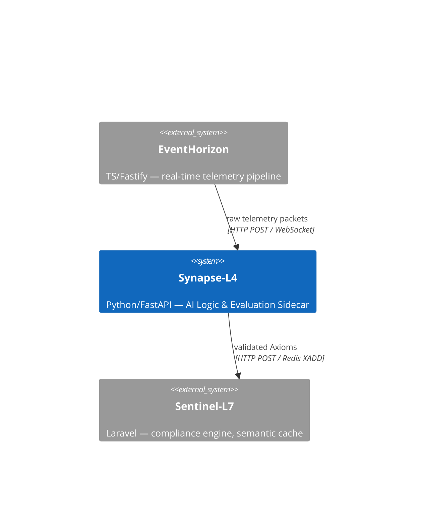
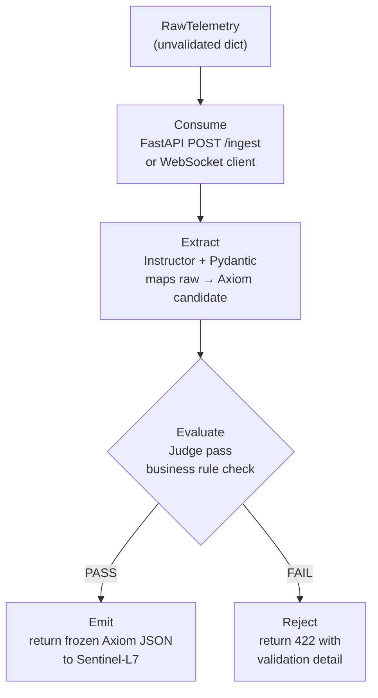

# Synapse-L4 — Architecture

## Overview

Synapse-L4 is a **Specification-Driven orchestration layer** — a Python/FastAPI microservice that sits between EventHorizon (raw telemetry) and Sentinel-L7 (compliance engine). Its core responsibility is enforcing strict output contracts on probabilistic LLM responses, transforming unstructured data into immutable, typed **Axioms**.

The central architectural insight: **LLMs are probabilistic; business logic is not.** Synapse-L4 is the boundary where probability becomes determinism.

---

## System Context



---

## Four-Stage Validation Node

Data flows **one direction only**: Consume → Extract → Evaluate → Emit.

No stage may invoke a downstream stage directly. Each stage receives a typed input, performs one responsibility, and returns a typed output.



### Stage 1 — Consume

**Files:** `src/api/ingest.py`, `src/clients/eventhorizon.py`

Accepts raw telemetry packets. Two entry points:
- **HTTP**: `POST /ingest` — synchronous request/response
- **WebSocket client**: `src/clients/eventhorizon.py` — subscribes to EventHorizon's observation plane WebSocket and pushes packets into the pipeline

Input is a loosely-typed `RawTelemetry` model. No LLM calls occur here — this stage only receives and forwards.

### Stage 2 — Extract

**Files:** `src/nodes/extractor.py`, `src/models/axiom.py`

The core LLM interaction. Uses **Instructor** (patched over the LLM client) to extract a structured `Axiom` from the raw telemetry. Instructor guarantees that the LLM response conforms to the Pydantic schema — it retries automatically if the model returns malformed output, up to `max_retries`.

**Pattern used:** *Structured Generation* — rather than prompting the LLM to "return JSON", we pass a Pydantic schema to Instructor which enforces conformance at the protocol level (function calling / tool use).

```python
# Instructor wraps the LLM client and enforces the response type
axiom_candidate = await client.chat.completions.create(
    model=settings.llm_model,
    response_model=Axiom,
    messages=[{"role": "user", "content": raw_payload}],
)
```

### Stage 3 — Evaluate

**Files:** `src/nodes/judge.py`, `src/evaluation/rules.py`

The **Judge pass**. Receives the Axiom candidate from the extractor and validates it against hard business rules that cannot be expressed as Pydantic field constraints alone — rules involving cross-field logic, domain thresholds, or external context.

Examples:
- `anomaly_score > 0.8` requires `status == "critical"` (cross-field consistency)
- `metric_value` must be within a plausible range for the declared `source_id` type

Failures are structured `JudgeRejection` objects — never bare exceptions — so the caller can return informative error responses.

**Pattern used:** *Validator-as-Judge* — a deterministic, code-level verification pass that acts as a guard after probabilistic LLM extraction. The Judge is not another LLM call; it is pure Python logic.

### Stage 4 — Emit

**Files:** `src/nodes/emitter.py`, `src/clients/sentinel.py`

Serializes the validated, frozen Axiom to JSON and delivers it to Sentinel-L7. The Axiom is never mutated between the Judge pass and emission — `frozen=True` on the Pydantic model enforces this at the Python level.

**Pattern used:** *Idempotent Emission* — the emitter attaches `emitted_at` and `source_id` so Sentinel-L7 can deduplicate on re-delivery.

---

## Axiom: The Shared Contract

`src/models/axiom.py` is the **single source of truth** for all data shapes in Synapse-L4. Every stage imports from this module — no stage defines its own event shape.

```python
class Axiom(BaseModel):
    model_config = ConfigDict(frozen=True)

    status: Literal["nominal", "degraded", "critical"]
    metric_value: float
    anomaly_score: Annotated[float, Field(ge=0.0, le=1.0)]
    source_id: str
    emitted_at: datetime
```

`frozen=True` makes all instances hashable and immutable. Any attempt to set a field after instantiation raises a `ValidationError`.

---

## Failure Modes

| Component | Failure | Behaviour |
|---|---|---|
| LLM unreachable | Instructor raises `openai.APIConnectionError` | 503 returned; no partial Axiom emitted |
| Instructor `max_retries` exhausted | LLM cannot conform to schema after N attempts | 422 with `extraction_failed` detail |
| Judge pass fails | Business rule violated | 422 with structured `JudgeRejection` |
| Sentinel-L7 unreachable | HTTP client timeout | 502; Axiom is not emitted; caller can retry |
| EventHorizon WS drops | `websockets.ConnectionClosed` | Client reconnects with exponential backoff |
| Invalid env var at startup | Pydantic `ValidationError` in `config.py` | Process exits immediately with clear message |

---

## Integration Points

### EventHorizon → Synapse-L4

| Mode | Mechanism | When to use |
|---|---|---|
| Push (recommended) | EventHorizon calls `POST /ingest` | Synchronous, request-scoped |
| Subscribe | Synapse-L4 WS client connects to EventHorizon `/live` | Continuous stream processing |

### Synapse-L4 → Sentinel-L7

| Mode | Mechanism |
|---|---|
| HTTP | `POST` to Sentinel-L7 ingestion endpoint |
| Redis Streams | `XADD` to Sentinel-L7's stream (at-least-once delivery) |

---

## Observability

All pipeline stages are instrumented with **Logfire** spans. Each Validation Node run produces:

- A root span covering the full Consume → Emit lifecycle
- Child spans per stage with input/output type info
- LLM token usage and latency from the Extract stage
- Judge pass result (PASS / FAIL + rule name)
- Emit delivery status

See `src/observation/` for instrumentation helpers.
