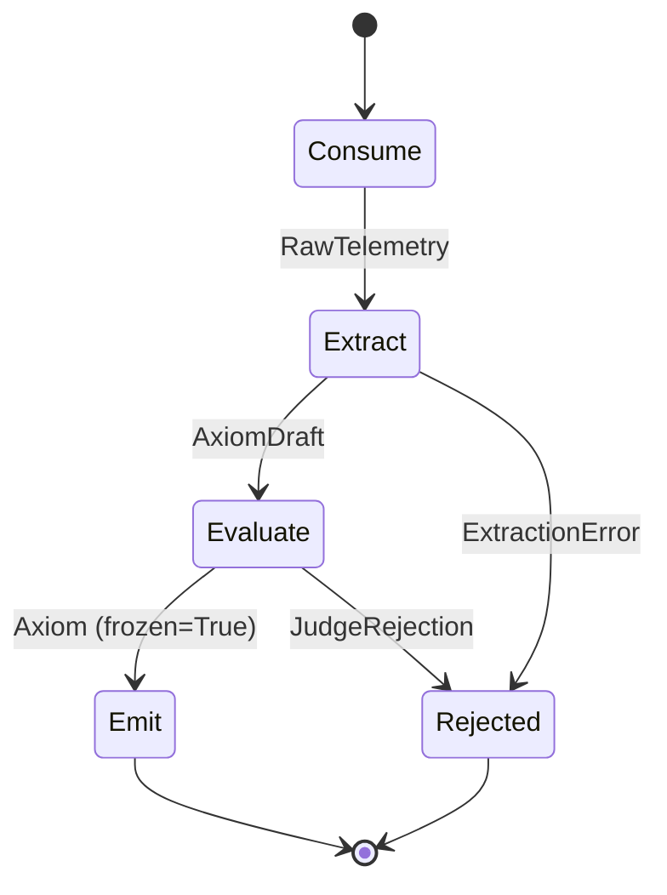

# Probes — Phase 1: Project Scaffold + Axiom Contract

```markdown
---
type: cloze
deck: Rhizome::synapse-l4
tags: [synapse-l4, phase-1, specification-driven-development]
---
If each pipeline stage defined its own shape for compliance data,
{{c1::schema drift}} between stages would be inevitable and likely silent.
`models/axiom.py` as the {{c2::single source of truth}} for `Axiom` prevents
this class of bug structurally — every later stage was written to satisfy
this one model.

Extra: synapse-l4 · Phase 1 · Pattern: Specification-Driven Development
See: docs/journal.md#phase-1-project-scaffold-axiom-contract-2026-03-31
```

---

```markdown
---
type: cloze
deck: Rhizome::synapse-l4
tags: [synapse-l4, phase-1, fail-fast-configuration]
---
{{c1::Fail-fast configuration}} means `config.py`'s Pydantic `BaseSettings`
validates all required env vars at {{c2::module import time}} — a missing
var raises `ValidationError` before FastAPI binds to a port, rather than
surfacing as a confusing runtime bug on the first request.

Extra: synapse-l4 · Phase 1 · Pattern: Fail-Fast Configuration
See: docs/journal.md#phase-1-project-scaffold-axiom-contract-2026-03-31
```

---

```markdown
---
type: cloze
deck: Rhizome::synapse-l4
tags: [synapse-l4, phase-1, frozen-value-objects]
---
In Pydantic v2, {{c1::frozen=True}} raises a {{c2::ValidationError}} at the
point of mutation — the type system enforces immutability rather than
relying on convention. This is the Value Object pattern from Domain-Driven
Design.

Extra: synapse-l4 · Phase 1 · Pattern: Frozen Value Objects
See: docs/journal.md#phase-1-project-scaffold-axiom-contract-2026-03-31
```

---

```markdown
---
type: cloze
deck: Rhizome::synapse-l4
tags: [synapse-l4, phase-1, type-driven-error-modeling]
---
{{c1::Typed exception classes}} (`JudgeRejection`, `ExtractionError`)
propagate automatically through the call stack and carry structured fields
like `rule` and `axiom_candidate` — unlike a {{c2::result tuple}}
`(Axiom | None, str | None)`, where nothing enforces the caller actually
checking the condition before using the value.

Extra: synapse-l4 · Phase 1 · Pattern: Type-Driven Error Modeling
See: docs/journal.md#phase-1-project-scaffold-axiom-contract-2026-03-31
```

---

```markdown
---
type: cloze
deck: Rhizome::synapse-l4
tags: [synapse-l4, phase-1, anti-pattern, mutable-validated-output]
---
{{c1::frozen=True}} makes it physically impossible for a pipeline stage
downstream of the Judge to mutate an already-validated `Axiom` — without it,
Sentinel-L7 could receive data that was never actually validated.

Extra: synapse-l4 · Phase 1 · Anti-Pattern Avoided: Mutable Validated Output
See: docs/journal.md#phase-1-project-scaffold-axiom-contract-2026-03-31
```

---

```markdown
---
type: cloze
deck: Rhizome::synapse-l4
tags: [synapse-l4, phase-1, pydantic-settings]
---
{{c1::AnyWebsocketUrl}} is the Pydantic v2 type that validates `ws://` and
`wss://` URLs. In `pydantic-settings` it requires the env var to be a full
URL string — a bare hostname fails validation.

Extra: synapse-l4 · Phase 1 · Challenge: AnyWebsocketUrl in pydantic-settings
See: docs/journal.md#phase-1-project-scaffold-axiom-contract-2026-03-31
```

---

```markdown
---
type: cloze
deck: Rhizome::synapse-l4
tags: [synapse-l4, phase-1, raw-telemetry]
---
`POST /ingest` accepts {{c1::RawTelemetry}} (`dict[str, Any]`), not `Axiom` —
if the route accepted `Axiom` directly, the pipeline would be reduced to a
{{c2::pass-through}}, since EventHorizon would have to pre-validate the data
that Synapse-L4 exists to validate.

Extra: synapse-l4 · Phase 1 · Decision: RawTelemetry as a Separate Input Model
See: docs/journal.md#phase-1-project-scaffold-axiom-contract-2026-03-31
```

---

## Mermaid Reference



```markdown
---
type: image-occlusion-placeholder
deck: Rhizome::synapse-l4
tags: [synapse-l4, phase-1, four-stage-pipeline, needs-manual-creation]
---
ACTION REQUIRED: Create Image Occlusion card manually in Anki desktop.

Concept: The four-stage validation node (Consume → Extract → Evaluate →
Emit) established in Phase 1 as the shared contract for every later phase.
Test recall of each stage's name, its input type, its output type, and which
typed exception it can raise — by occluding one node/edge at a time.

Source diagram: #phase-1-four-stage-pipeline (see Mermaid block above)

Suggested occlusion regions:
- Occlude "Extract" — what stage turns RawTelemetry into AxiomDraft?
- Occlude "AxiomDraft" — what type does Extract produce, distinct from Axiom?
- Occlude "Evaluate" — which stage is mandatory between Extract and Emit?
- Occlude "Axiom (frozen=True)" — what type does Emit receive, and what
  Pydantic config makes it immutable?
- Occlude "JudgeRejection" / "ExtractionError" — which exception comes from
  which stage?

Steps:
1. Render the Mermaid block above to PNG (paste source at mermaid.live)
2. In Anki desktop: Add → Image Occlusion → import PNG
3. Draw rectangles over each suggested region
4. Add to deck: Rhizome::synapse-l4
5. Delete this placeholder card after creation
```
